[github](https://github.com/rarerege) &nbsp;·&nbsp;
[linkedin](https://www.linkedin.com/in/raghav-rege/) &nbsp;·&nbsp;
[email](mailto:raghav.rege@gmail.com)

> B.Tech CS (Blockchain Technology) @ SRMIST &nbsp;·&nbsp; Blockchain Research Intern @ Samsung Prism. 
> Small, sharp systems over big vague ideas.

AI/ML and backend engineer shipping production systems end-to-end — two publicly 
deployed AI APIs, a Solana NFT marketplace on devnet, and research presented at an 
international conference. Currently building 
[mandate-gateway](https://github.com/rarerege/mandate-gateway), a merchant-side 
authorization layer for AI shopping agents.

<samp>python &nbsp; java &nbsp; rust &nbsp; javascript &nbsp; solidity &nbsp; fastapi &nbsp; scikit-learn &nbsp; xgboost &nbsp; postgresql &nbsp; docker &nbsp; solana</samp>

**[sentiment-analysis-api](https://github.com/rarerege/sentiment-api)** &nbsp;·&nbsp; <samp>python, fastapi, xgboost</samp> 
Production ML inference behind Redis caching — under 15ms on a cache hit, 
84.8% accuracy and 0.92 ROC-AUC on a 50,000-review IMDB benchmark.

**[rag-document-qa-api](https://github.com/rarerege/rag-qa-api)** &nbsp;·&nbsp; <samp>python, fastapi, langchain</samp> 
Retrieval-augmented QA over uploaded PDFs, answers grounded in cited 
passages, with token-by-token streaming over WebSocket.

**solana-nft-marketplace** &nbsp;·&nbsp; <samp>rust, anchor, solana</samp> 
NFT marketplace shipped to devnet as the reference implementation for 
comparative Sui / Aptos / Solana research at Samsung Prism.

**[mandate-gateway](https://github.com/rarerege/mandate-gateway)** &nbsp;·&nbsp; <samp>python, fastapi</samp> 
Decides whether a merchant should honor an AI shopping agent's order — 
signature verification, reputation scoring, policy engine, zero LLM calls 
in the decision path.

Every graphic on this page is generated inside this repository, not pulled 
from someone else's server. `ascii.svg` is a photo pushed through a 
character ramp by [`scripts/make_portrait.py`](scripts/make_portrait.py); 
the stat graphics and the section headings are drawn by 
[a scheduled action](.github/workflows/stats.yml) straight from the GitHub 
GraphQL API, once a day, committing only what changed.

They animate with SMIL inside the SVG, because GitHub strips scripts from 
READMEs — and since nothing loads from a third party, nothing here can 
rate-limit or go dark. The headings are SVGs for the same reason: GitHub 
also strips CSS, so an image is the only way to put this page's own 
typeface on them.

The typeface is [JetBrains Mono](scripts/fonts), subset to just the 
characters each graphic draws and inlined as base64 — the portrait's grid 
assumes an advance width of exactly 0.600 em, and a viewer whose default 
monospace is narrower would otherwise see it squeezed.

Language totals cover public repositories only. `year.svg` uses the 
portrait's own character ramp: `:` `+` `#` `@`, quiet to loud.

Pipeline and portrait technique adapted from the [ASCII Portrait README 
Guide](https://burly-handstand-0dc.notion.site/ASCII-Portrait-README-Guide-3a3e3f86338481f0b545ec8120bbf604).
